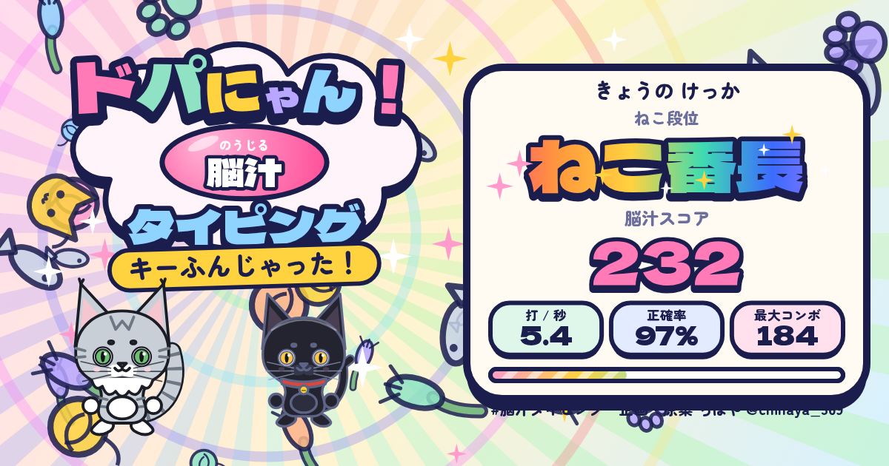

# ドパにゃん！脳汁タイピング

打つたびに猫がキーを踏んで、「ねこふんじゃった」が1音ずつ鳴るタイピングゲームです。速く打つほどテンポが上がり、演出も音も盛り上がっていきます。ブラウザだけで動きます（インストール不要・無料）。

**▶ 遊ぶ：https://chihaya.love/dopa/typing/**



> これは [grmchn/dopa-drill](https://github.com/grmchn/dopa-drill)（ドパドリル）を改造した、**非公式の二次創作（フォーク）** です。公式のものではありません。

## 特徴

- 打鍵ごとに曲が1音進む。伴奏はプレイヤーの位置に合わせて変わる
- ローマ字入力（ヘボン式・訓令式などの揺れはすべて正解）。PCのキーボードでも、スマホの画面キーでも遊べる
- 出題はすべて意味のある語・文：ねこ文、日常文、ことわざ、四字熟語、俳句、辞書由来の約2,700語
- 30コンボで FEVER、60コンボで「マタタビモード」。ときどき金色の文字（LUCKY）が出る
- 90秒チャレンジ（エクストラ）はいつでも遊べる
- 曲は11曲（ねこふんじゃった、きらきら星、トルコ行進曲など）。楽器の組み合わせ5種
- 結果をかわいい画像にして保存・コピー・共有できる
- 名前を登録できる。記録はすべて端末内（localStorage）に保存し、外部には送信しない
- 音楽と効果音はすべて Web Audio で合成（音声ファイルなし）

## ローカルで動かす

ビルドは不要です。`app/` を静的に配信するだけで動きます。

```bash
python3 -m http.server 8000 -d app
```

ブラウザで `http://localhost:8000/` を開いてください。ES Modules を使っているため、`file://` で直接開くと動きません。

## テスト

Node.js 20 以上。

```bash
node --test tests/*.test.mjs
```

## 構成

| パス | 内容 |
| --- | --- |
| `app/` | ゲーム本体（依存ライブラリなしの ES Modules）。そのままサーバーに置けば公開できる |
| `app/data/typing.js` | 出題データ（生成物） |
| `src/sentences.txt` | 書き下ろしの文・ことわざ・四字熟語・俳句（`種類|本文|よみ|意味`） |
| `tools/build_typing.py` | `typing.js` の生成。語のデータは姉妹版「漢字編」の `kanji.js` から作る |
| `tools/build_fonts.py` | フォントのサブセット再生成（画面の文言を増やしたときに実行） |
| `docs/SPEC.md` | 仕様書 |
| `tests/` | 単体テスト |

公開するときは、`app/index.html` の `og:image` / `og:url` / `twitter:image` と `window.SITE_URL` を、自分の公開URLに書き換えてください。

## ライセンスと出典

詳しくは [NOTICE.md](NOTICE.md) を見てください。要点は次のとおりです。

- ソースコード：MIT License（元の「ドパドリル」のライセンスを引き継ぎ、[LICENSE](LICENSE) にそのまま残しています）
- **元のキャラクター・名称・ロゴには例外があります**（[LICENSE](LICENSE) の "Exceptions"）。営利目的でない二次創作・改造は自由ですが、営利利用や、別の製品の名前・ブランドとして使うことには事前の許可が必要です。公開するときは「非公式」であることを明記してください
- 語のデータ（`app/data/typing.js`）：CC BY-SA 4.0（KANJIDIC2・JMdict・JmdictFurigana などから作成）
- 書き下ろしの文：本リポジトリのMITに含まれます
- フォント（`app/fonts/`）：SIL Open Font License 1.1

## 作者

企画・原案：ちはや（https://chihaya.love ／ [@chihaya_369](https://x.com/chihaya_369)）  
元の「ドパドリル」：gear_machine（grmchn）
